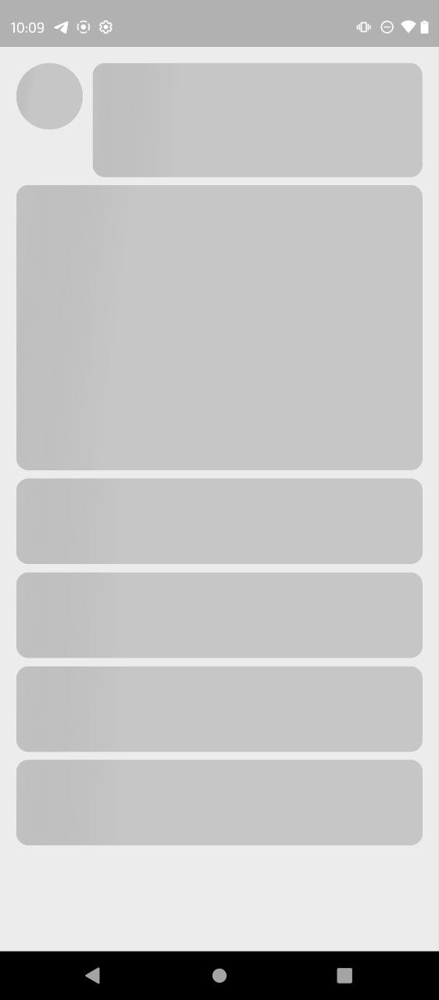
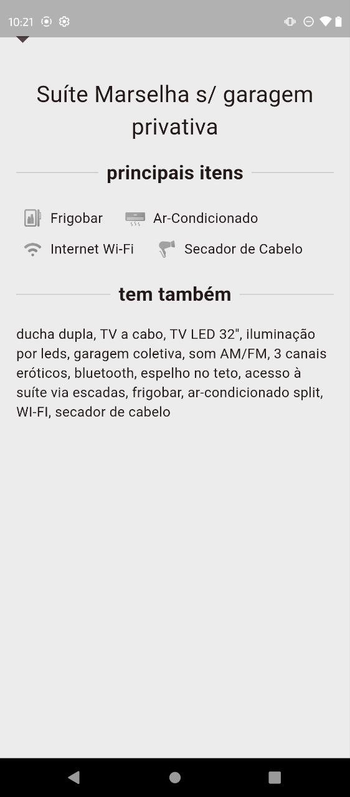
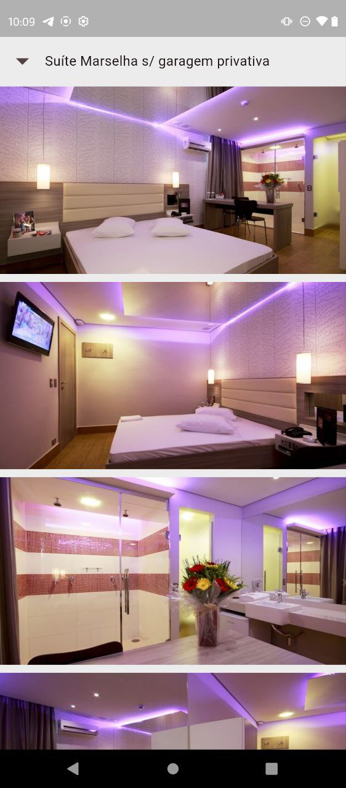
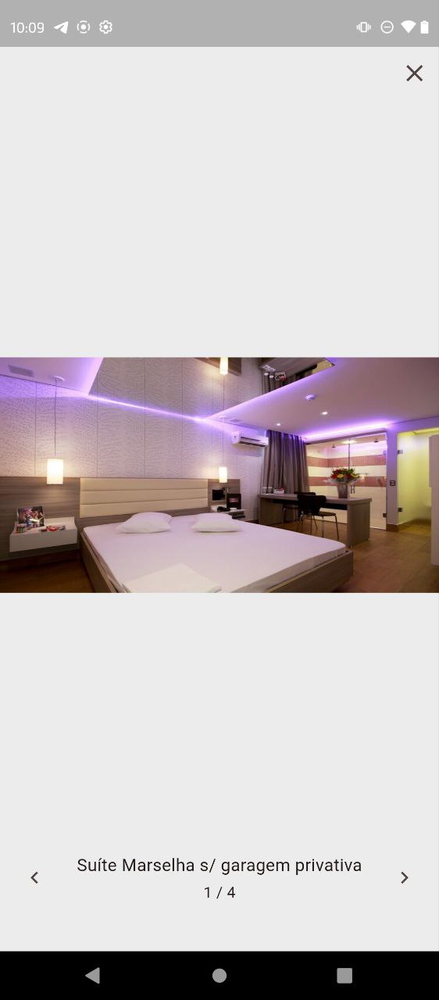

# Moteis

## Descrição
Moteis é um aplicativo Flutter desenvolvido para listar motéis e suas respectivas suítes, permitindo a visualização detalhada dos itens disponíveis em cada suíte. O aplicativo segue os princípios da arquitetura limpa (Clean Architecture) e utiliza o BLoC para gerenciamento de estado. Além disso, conta com abstrações para comunicação com a rede e testes unitários para a lógica de negócio.

## Funcionalidades e Tecnologias
- **Listagem de motéis e suítes**
- **Visualização de itens presentes nas suítes**
- **Tela de visualização de imagens das suítes**
- **Loading com Shimmer Effect**

## Tecnologias Utilizadas
- **Clean Architecture**
- **Testes Unitários**
- **BLoC (Business Logic Component)**
- **Abstração para as dependências externas**
- **Cache para imagens**
- **Injeção de dependência**

## Estrutura do Projeto
```
lib/
|-- core/                # Configurações gerais e abstrações
|-- infra/               # Repositórios e fontes de dados
|-- domain/              # Entidades e casos de uso
|-- presentation/        # Camada de UI e gerenciamento de estado separados por funcionalidades
```

## Como Executar
1. **Clone o repositório**
```sh
  git clone https://github.com/lucas-242/motels_list.git
  cd motels_list
```
2. **Instale as dependências**
```sh
  flutter pub get
```
3. **Execute o aplicativo**
```sh
  flutter run
```

## Testes
Para rodar os testes unitários, utilize o comando:
```sh
  flutter test
```

## Imagens do Aplicativo

### Tela de loading


### Tela Inicial


### Tela de itens da suíte


### Tela de imagens da suíte


### Tela de detalhe da imagem



## Vídeo do Aplicativo
[Assistir vídeo completo](assets/videos/app_video.mp4)

